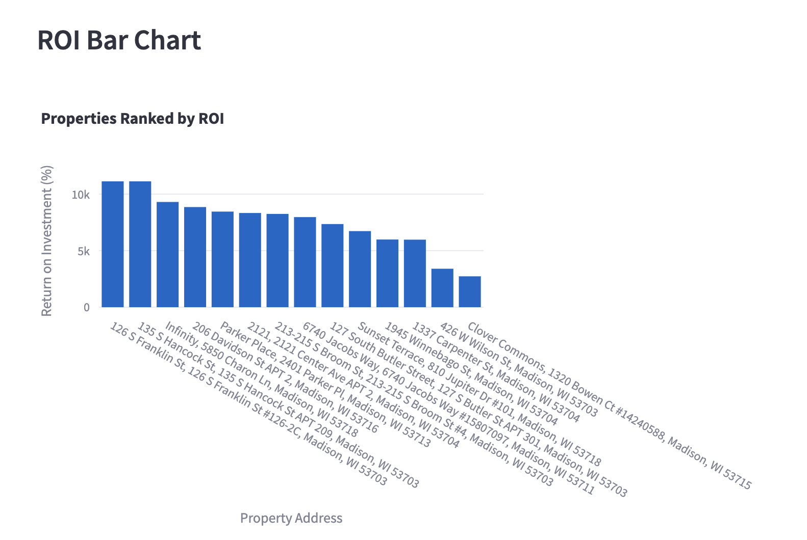
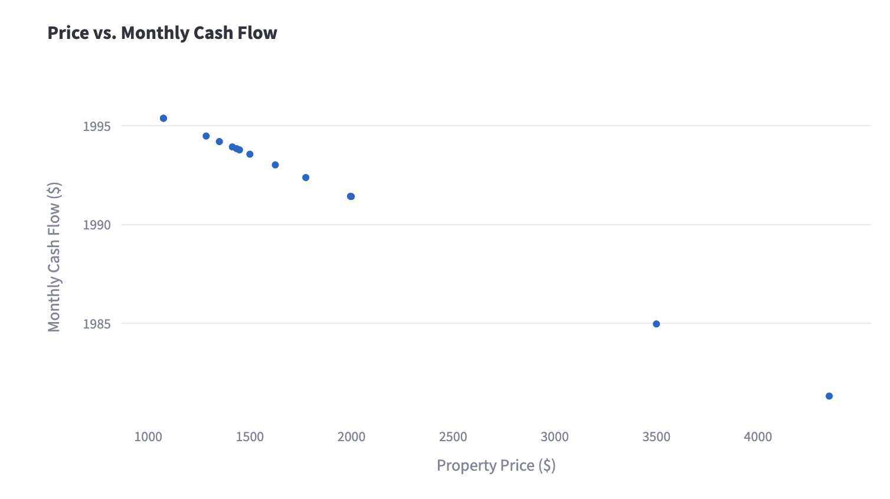
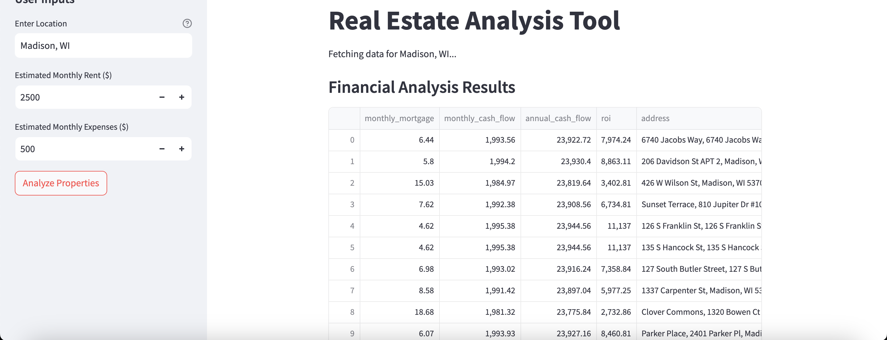

# Real Estate Investment Dashboard

Analyze profitable house-hacking opportunities using Python, Streamlit, and Plotly.

## Project Description

This interactive tool fetches real estate data from the Zillow API, performs financial modeling, and visualizes key metrics like ROI and cash flow. Designed for aspiring investors, it simplifies identifying house-hacking opportunities with actionable insights.

## Features

- Fetches real estate data using the Zillow API
- Cleans and processes raw data for analysis
- Calculates key financial metrics:
  - Return on Investment (ROI)
  - Monthly cash flow
  - Annual cash flow
- Provides dynamic visualizations:
  - ROI bar chart
  - Price vs. cash flow scatter plot
- Interactive dashboard with user inputs for:
  - Location
  - Rent and expenses

## Technologies Used

- **Programming Language**: Python
- **Libraries**: pandas, Plotly, Streamlit, requests
- **API**: Zillow API
- **Version Control**: Git, GitHub

## Screenshots

### ROI Bar Chart


### Price vs. Cash Flow Scatter Plot


### Interactive Dashboard


## Installation and Usage

1. **Clone the Repository**:
   ```bash
   git clone https://github.com/romanlicursi/real_estate_analyzer.git
   cd real_estate_analyzer
   ```

2. **Create and Activate a Virtual Environment**:
   ```bash
   python -m venv venv
   source venv/bin/activate  # On Mac/Linux
   venv\Scripts\activate     # On Windows
   ```

3. **Install Dependencies**:
   ```bash
   pip install -r requirements.txt
   ```

4. **Run the Dashboard**:
   ```bash
   streamlit run app/streamlit_dashboard.py
   ```

5. **Open the Provided URL in Your Browser**

## Skills Demonstrated

- **API Integration**: Integrated the Zillow API to fetch and process real estate data
- **Data Analysis**: Cleaned and transformed raw data using pandas
- **Financial Modeling**: Implemented ROI, cash flow, and mortgage calculations
- **Visualization**: Created dynamic visualizations using Plotly
- **Dashboard Development**: Built an interactive Streamlit dashboard for user-friendly analysis

## Future Enhancements

- Add a feature to compare multiple locations
- Incorporate additional financial metrics like Cap Rate and IRR
- Deploy the dashboard online for public access

## License

This project is licensed under the MIT License.
